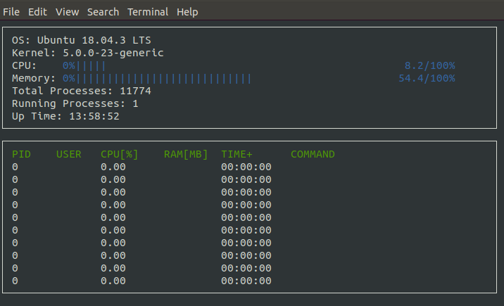

# CppND-System-Monitor

This project implements a process manager for the ubuntu, similar to **htop**. and depend on **ncurses** to display information inside the console.


<div align=center></div>

## Dependencies

* cmake >= 2.6
* [ncurses](https://www.gnu.org/software/ncurses/)
    ```
    sudo apt install libncurses5-dev libncursesw5-dev
    ```
## Cloning

Clone the project repository: `git clone https://github.com/suljaxm/CppND-System-Monitor.git`


## Compiling and Running

### Compiling
To compile the project, first, create a `build` directory and change to that directory:
```
mkdir build && cd build
```
From within the `build` directory, then run `cmake` and `make` as follows:
```
cmake ..
make
```
### Running
Run the resulting executable: `./build/monitor`
